# Provision Backbone POP

The ProvisionBackbonePOP script allows to fully provision a typical FFHO backbone POP, including

 * Mgmt prefix + VLAN
 * Rack
 * Patch panel including cabling to outdoor surge protectors (if any)
 * a switch, precabled to patch panel front ports, ports configured, and mgmt IP set
 * a backbone router, with ports configured, and loopback IP + mgmt VLAN/IP set
 * switch + backbone router also having asset tag and S/N set

The site only contains two manually created access points prior to script execution:

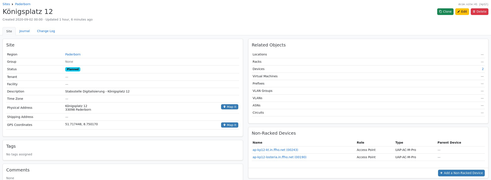

The form prefills rack name and rack units, as this are the defaults we use

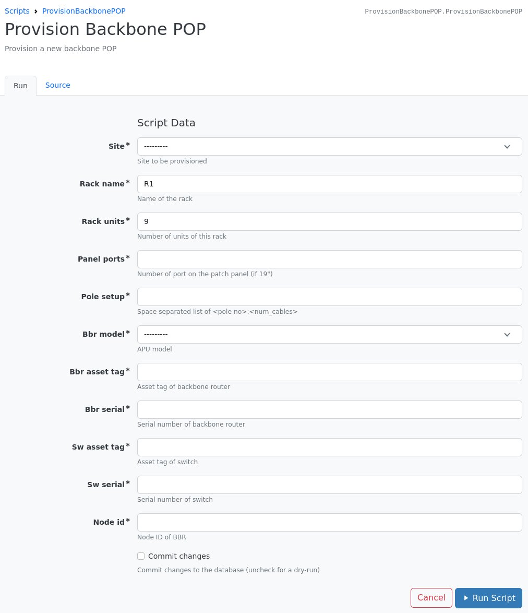

Once the form is filled with all required data and run ...

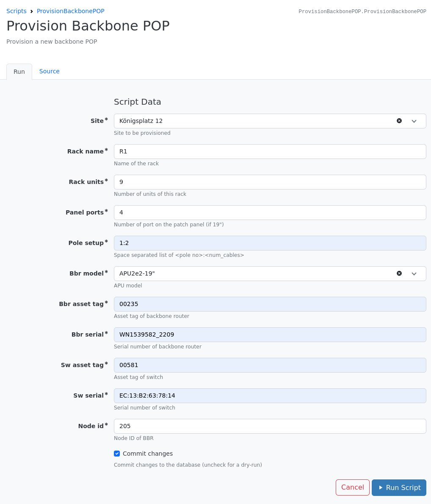

it will show a log of what things were already present or have been created / set up.

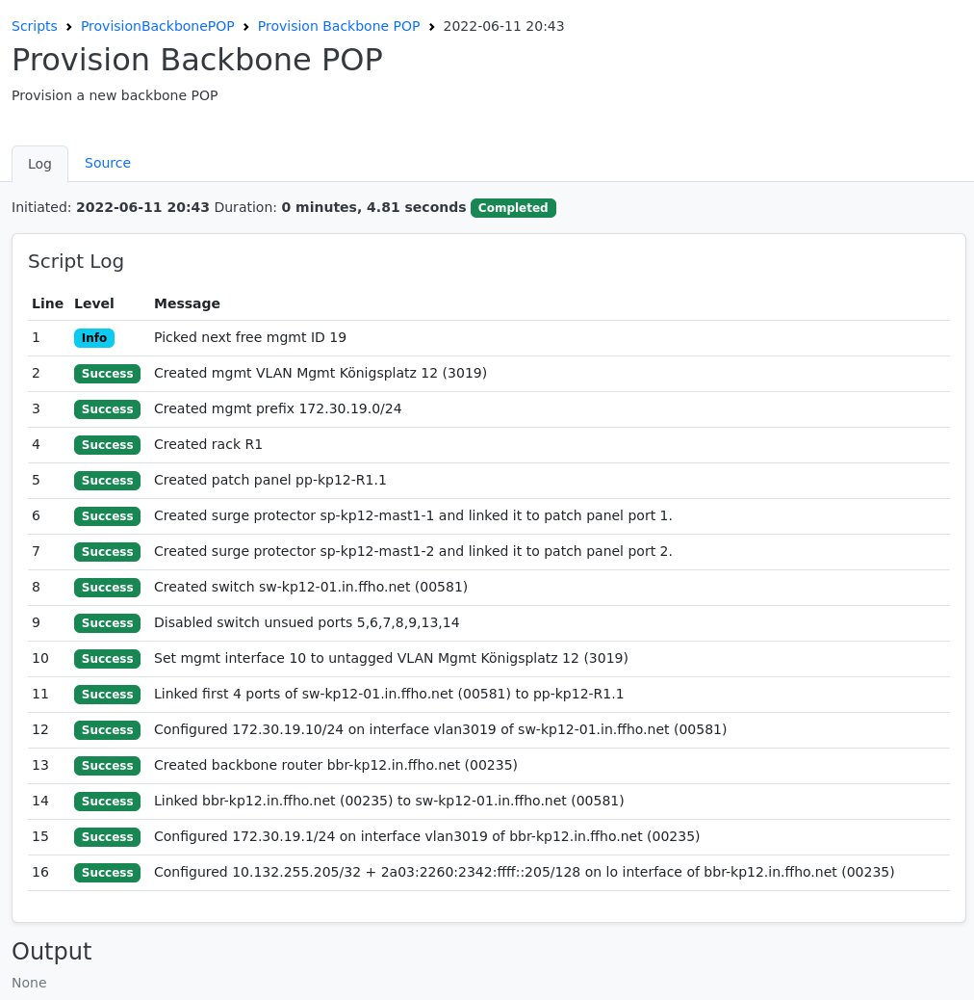

If we now look at the site again, we can see that a rack, prefix, VLAN and 5 additional devices are associated with it

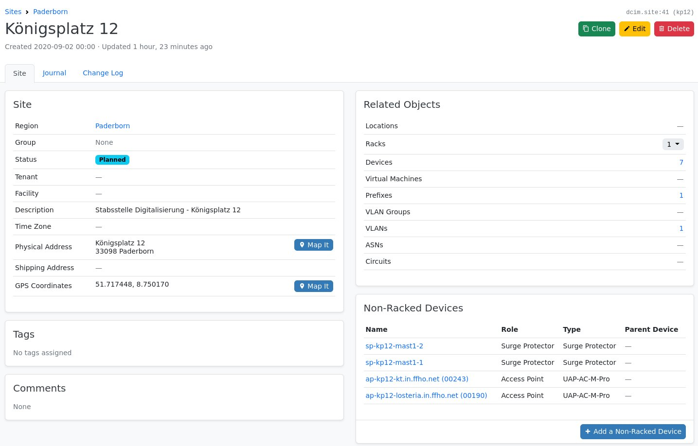

The devices on the site contain the two APs already present before the script run, as well as the created backbone router,
patch panel, two surge protectors as well as the switch.

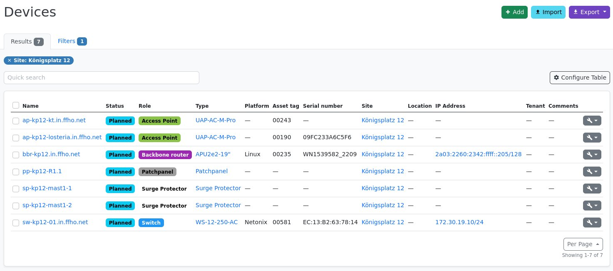

If we look at the rack we can see that a wall-mounted cabinet with 9 RUs was created, and patch panel, switch and
backbone router are installed inside it.

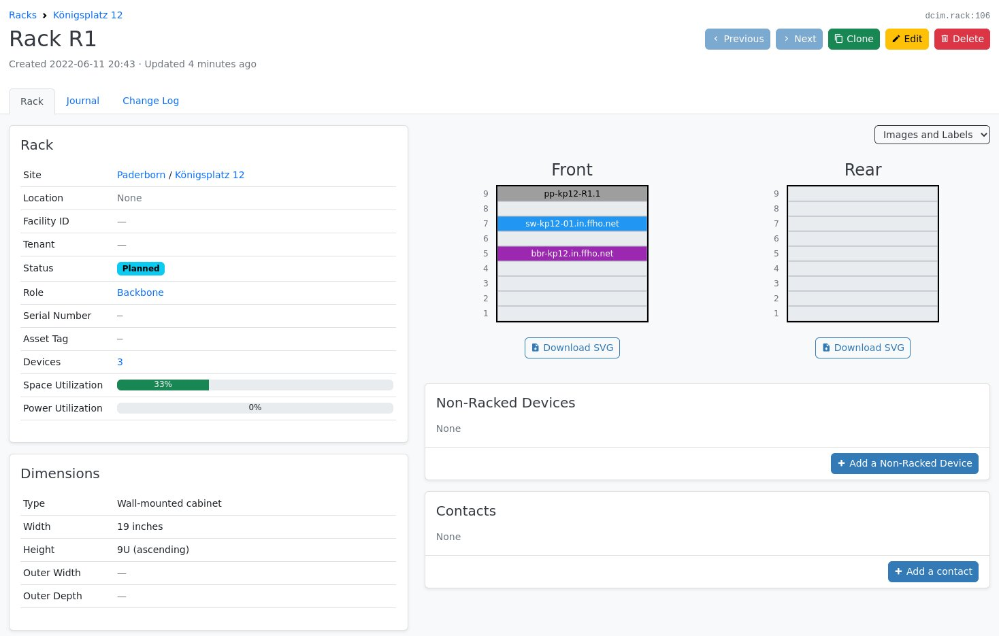

The patch panel front ports have all been patched to the first interfaces of the switch (cables are marked as planned),
and the panel rear ports are connected to sureg protectors created for poles if a pole setup was given (German "mast" means "pole").

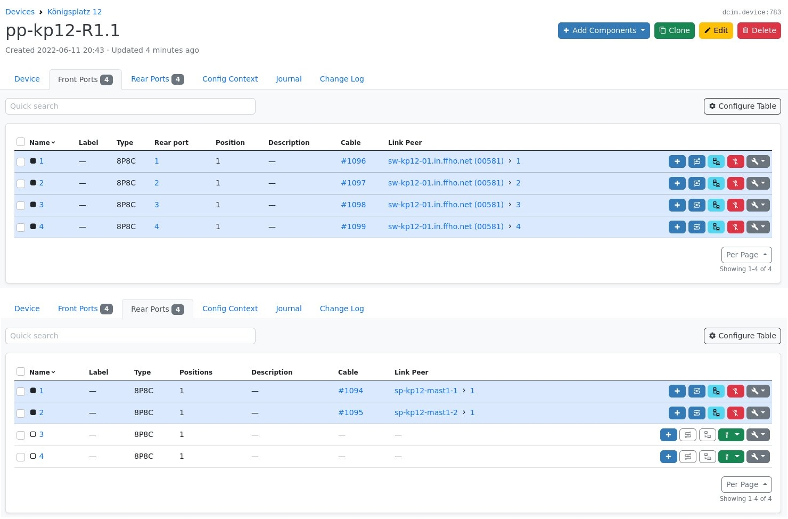

If multiple poles / connections per pole are given for the pole setup, surge protectors will be created according to the
layout given for the pole setup (space separated list of `<pole no>:<# cables>`) and connected to the panel rear ports.

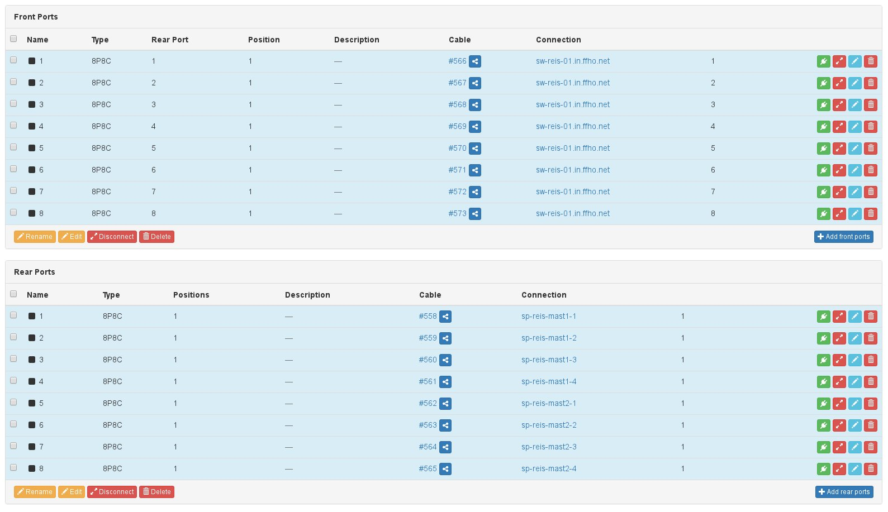

The switch device overview shows asset tag, serial number, primary IP, and rack position, which all have been set up.

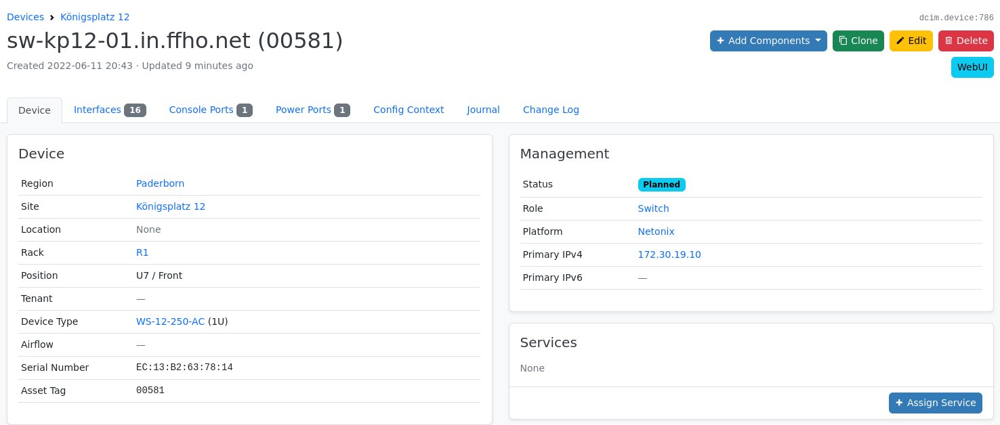

As much switch interface as panel ports have been given are linked to the patch panel front ports, a mgmt port is set up,
the last two copper interfaces are connected to the backbone router and bundled into a LAG, a vlan interface is configured
with the management IP and all remaining interfaces were disabled.

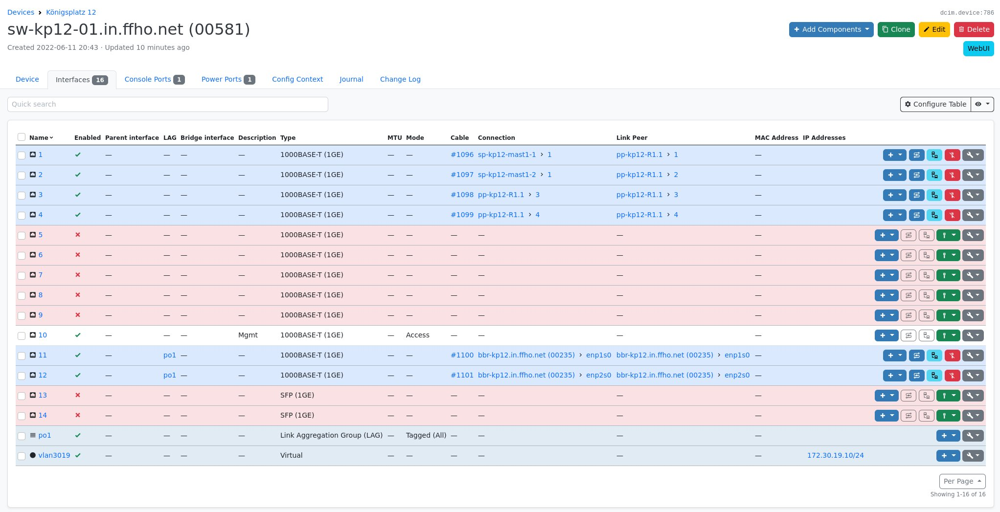

The backbone routers device overview also shows asset tag, serial number, primary IPs, and rack position, similar to the switch

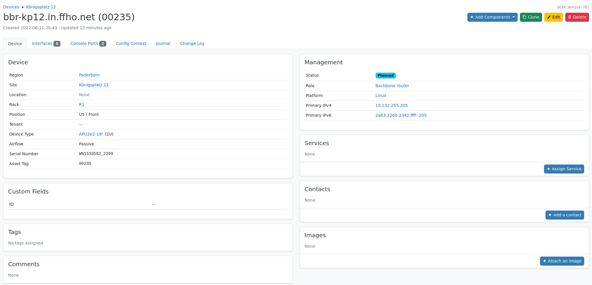

The first two backbone router interfaces, which are connected to the switch, are also bundle into a LAG, a VLAN interface
for the management network is created with the LAG as parent and a generated IP, and loopback IPs are set.  Remaining ports
are also disabled.

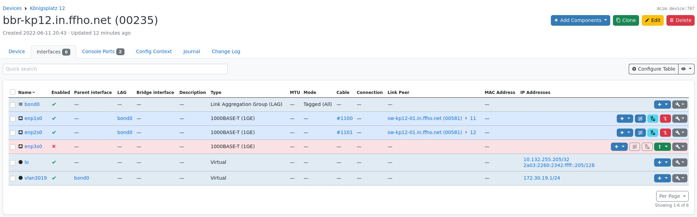
