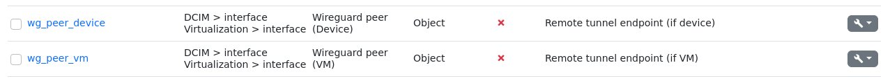
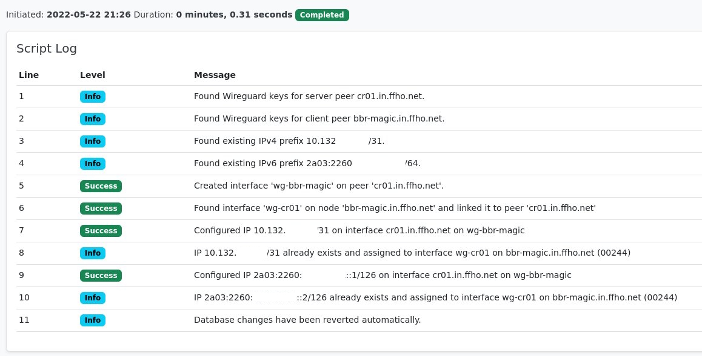

# Provision Wireguard tunnels

This script provisions Wireguard tunnels in NetBox between two nodes, allowing each side
to be a Device or a VM.  To model the connection between two nodes custom fields (type object)
on interfaces are used which will be set to the remote Device or VM.  IP allocation happens
programatically so that the only input to the script are server + client Device or VM.

## Prerequisites

### Custom Fields for peers

The script requires two custom fields on interfaces to operate, which represent the remote
peer, either for physical devices or VMs. It needs two custom fields as the model for device
and VM interfaces are two distinct types in NetBox. The following screenshot shows the two
custom fields and their parameters:

### Config Context for Wireguard keys

The script enforces that devices/VMs, which should terminate a Wireguard tunnel, have their
Wireguard public and private keys stored in their Config Context as follows:

    "wireguard": {
        "privkey": "xxx",
        "pubkey": "yyy"
    }

The script itself does not work with these values, however this ensures that the down-stream
automation stack will find all required information to configure tunnels set up in NetBox.

### Tag Wireguard

To identify an interface as a Wireguard tunnel, the script adds a Tag with the name `Wireguard` to it.
This has to be created before the script can be used.

## Script run - server vs. client

The script will ask for a `server` and `client` peer device or VM, with a drop-down menu
for all Devices and VirtualMachines respectively, each filtered for Platform Linux.
The reason there's two drop-downs for server and client respectively is that the NetBox
data model, understandably, does not allow to set up a custom field of type Object, for
multiple data types (`Device` and `VirtualMachine`). Hence you need to select server and
client of the tunnel from devices or VMs, as fits the use case.

The script form looks like this:

In the sense of this script `server` means the peer which will be listening on a (computed)
UDP port for connections from the `client`. `Client` means the peer will try to connect to
the `server`.

The UDP port any given operates on is not stored in NetBox as it is
[calculated based on the IPv6 prefix used for the tunnel](https://github.com/BarbarossaTM/nacl/blob/b0b369475ff07fd3ad4ffaee4ed9046a67a8f4e9/nacl/modules/wireguard.py#L87-L100)
in a downstream system.

The script will
 * check for the existance of Wireguard keys on both peers
 * create an interface for the remove peer on both sides (`wg-<peer>` or `oob-<peer>`)
 * assign a prefix for the tunnel (IPv4 + IPv6)
 * assign IPs to both interfaces
 * if it's an OOBM tunnel, assign the OOBM VRF to the client side interface

A successful run could look like this

